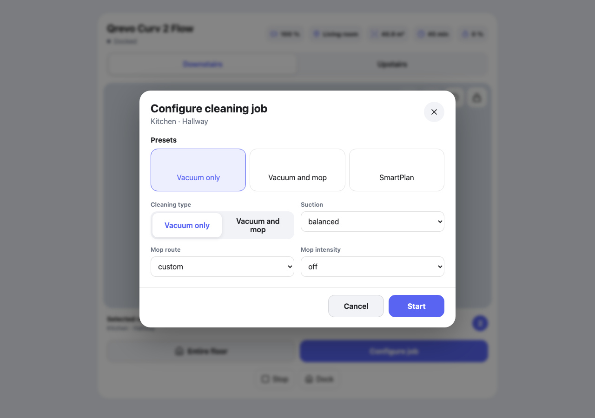

# Roborock Vacuum Map Card

A Roborock-native Home Assistant Dashboard card for selecting multiple rooms, configuring one cleaning profile, and launching safe native `vacuum.clean_area` jobs.



## Features

- Calibrated Roborock maps with zoom, pan, accessible SVG room overlays, and room labels
- Multiple room selection followed by an explicit **Configure job** step
- Configurable **Entire floor** membership, including excluded-but-individually-selectable rooms
- Built-in Vacuum only, Vacuum and mop, and SmartPlan presets plus user presets
- Live capability detection for fan speeds, mop routes, mop intensity, transport controls, and floor options
- SmartPlan-safe route changes through `custom` before `standard`, `deep`, `deep_plus`, or `fast`
- Draft-only settings until Start is pressed; service failures abort before cleaning and retain the draft
- Visual Lovelace editor with room discovery, HA-area mapping, floor/preset reordering, and lossless YAML round-tripping
- Responsive mobile bottom sheet, desktop dialog, light/dark HA themes, keyboard support, English, and Dutch
- One HACS-installable JavaScript bundle

## Requirements

- Home Assistant 2026.3 or newer for native `vacuum.clean_area`
- The official Roborock integration with map segments mapped to Home Assistant areas
- [Roborock Custom Map](https://github.com/Python-roborock/RoborockCustomMap) for an image entity containing `rooms` and `calibration_points`
- HACS is recommended for installation

The card never guesses room hitboxes. A missing custom-map image, room metadata, or calibration produces a prerequisite error.

## Install with HACS

1. In HACS, open the three-dot menu and choose **Custom repositories**.
2. Add `https://github.com/domidyon/roborock-vacuum-map-card` as a **Dashboard** repository.
3. Install **Roborock Vacuum Map Card**.
4. Refresh the browser when HACS asks.
5. Add a card and choose **Roborock Vacuum Map Card** in the visual editor.

Manual installation is also possible: download `roborock-vacuum-map-card.js` from the latest release, place it under `/config/www/`, and register it as a JavaScript module in Settings → Dashboards → Resources.

## Visual editor setup

The editor supports the complete setup without hand-written YAML:

1. Select the vacuum and optional status/settings entities.
2. Add each floor and select its Roborock Custom Map image.
3. The editor discovers segments from the image entity's `rooms` attribute.
4. Map each segment to a Home Assistant area, then set its label, icon, and **Include in Entire floor** value.
5. Add optional presets and select a default.

If areas are missing, configure segment-to-area mapping in the Roborock vacuum entity settings first.

## YAML reference

```yaml
type: custom:roborock-vacuum-map-card
entity: vacuum.qrevo_curv_2_flow
language: nl

entities:
  map_select: select.qrevo_curv_2_flow_selected_map
  mop_mode: select.qrevo_curv_2_flow_mop_mode
  mop_intensity: select.qrevo_curv_2_flow_mop_intensity
  battery: sensor.qrevo_curv_2_flow_battery
  current_room: sensor.qrevo_curv_2_flow_current_room
  cleaning_area: sensor.qrevo_curv_2_flow_cleaning_area
  cleaning_time: sensor.qrevo_curv_2_flow_cleaning_time
  cleaning_progress: sensor.qrevo_curv_2_flow_cleaning_progress
  status: sensor.qrevo_curv_2_flow_status
  error: sensor.qrevo_curv_2_flow_vacuum_error

floors:
  - id: downstairs
    name: Beneden
    map_entity: image.woonkamer_qrevo_curv_2_flow_beneden_custom
    map_select_option: Beneden
    rooms:
      - segment_id: 1
        area_id: kitchen
        name: Keuken
        icon: mdi:countertop
        include_in_floor_clean: true
      - segment_id: 2
        area_id: hallway
        name: Hal
        icon: mdi:coat-rack
        include_in_floor_clean: true
      - segment_id: 4
        area_id: living_room
        name: Woonkamer
        icon: mdi:sofa
        include_in_floor_clean: true
  - id: upstairs
    name: Boven
    map_entity: image.woonkamer_qrevo_curv_2_flow_map_1_custom
    map_select_option: Boven
    rooms:
      - segment_id: 1
        area_id: office
        name: Kantoor
        icon: mdi:desk
        include_in_floor_clean: true
      - segment_id: 2
        area_id: bathroom
        name: Badkamer
        icon: mdi:shower
        include_in_floor_clean: false
      - segment_id: 3
        area_id: overloop
        name: Overloop
        icon: mdi:stairs
        include_in_floor_clean: true
      - segment_id: 4
        area_id: bedroom
        name: Slaapkamer
        icon: mdi:bed-king
        include_in_floor_clean: true
      - segment_id: 5
        area_id: waskamer
        name: Waskamer
        icon: mdi:washing-machine
        include_in_floor_clean: true

presets:
  - id: avond
    name: Avond
    icon: mdi:weather-night
    strategy: custom
    cleaning_type: vacuum
    fan_speed: quiet
    mop_mode: custom
    mop_intensity: off

default_preset: vacuum_only
```

### Configuration fields

| Field | Required | Description |
|---|---:|---|
| `entity` | Yes | Roborock `vacuum.*` entity |
| `language` | No | `en` (default) or `nl` |
| `entities.map_select` | For 2+ floors | Select entity and live floor options |
| `entities.mop_mode` | No | Roborock mop route/mode select |
| `entities.mop_intensity` | No | Roborock mop intensity select |
| `entities.*` status fields | No | Compact values shown only when configured and available |
| `floors` | Yes | One or more floor mappings |
| `floor.map_entity` | Yes | Calibrated Roborock Custom Map image |
| `floor.rooms` | Yes | Segment-to-area mappings and floor-clean membership |
| `presets` | No | Structured additional presets; arbitrary service YAML is intentionally unsupported |
| `default_preset` | No | Built-in or configured preset ID |

## Service behavior

Start validates every requested option against live entity options. It then:

1. Selects and confirms the target floor when necessary.
2. Applies mop mode, including the safe `smart_mode` → `custom` transition when needed.
3. Applies mop intensity.
4. Applies fan speed with `vacuum.set_fan_speed`.
5. Calls `vacuum.clean_area` once with all selected HA area IDs in `cleaning_area_id`.

SmartPlan only sets `smart_mode`; it does not send manual fan or intensity overrides. Entire-floor jobs always use their configured area list rather than `vacuum.start`, so excluded rooms stay excluded.

Pause, resume, stop, and dock use `vacuum.pause`, `vacuum.start`, `vacuum.stop`, and `vacuum.return_to_base`. `vacuum.start` is exposed only as Resume while paused.

## Troubleshooting

- **Calibration/rooms missing:** confirm the selected image comes from `roborock_custom_map`, then reload that integration after the core Roborock integration is loaded.
- **Room disabled:** assign an HA `area_id` in the visual editor and make sure that segment is mapped in Roborock entity settings.
- **Preset unavailable:** its fan speed, mop mode, or intensity is absent from the live entity options. Use a supported value or another preset.
- **Floor timeout:** verify `map_select_option` exactly matches a live option on `entities.map_select`.
- **Card not found after install:** hard-refresh the browser and verify the HACS resource is loaded as a JavaScript module.
- **Cleaning does not start:** the error toast names the failed operation. The card deliberately does not fall back or roll back device settings automatically.

## Development

```bash
npm install
npm run verify
npx playwright install chromium
npm run test:e2e
```

The production bundle is `dist/roborock-vacuum-map-card.js`.

## Credits and trademark notice

Selected interaction and presentation patterns were adapted from the MIT-licensed [Dreame Vacuum Map Card](https://github.com/noambergauz/dreame-vacuum-map-card). See [NOTICE](NOTICE) for exact attribution.

Roborock is a trademark of Beijing Roborock Technology Co., Ltd. This unofficial project is not affiliated with or endorsed by Roborock.

## License

[MIT](LICENSE)
